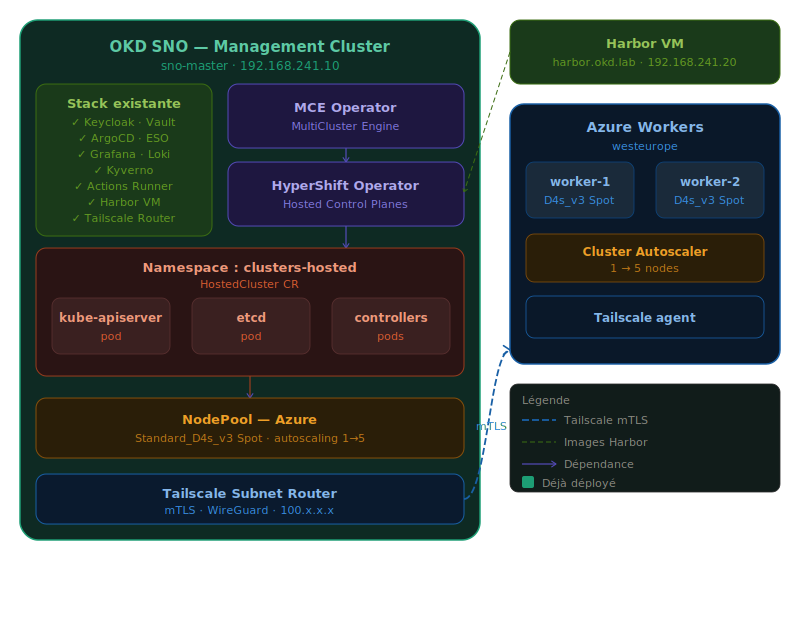

# OKD HyperShift Security Platform

> **Portfolio project** — Hosted Control Planes on OKD SNO with Azure Spot workers, secured end-to-end with Zero Trust, GitOps, and supply chain controls.

---

## Architecture Overview



```
┌─────────────────────────────────────────────────────────────────────┐
│                  OKD SNO — Management Cluster                       │
│                  sno-master · 192.168.241.10                        │
│                                                                     │
│  ┌─────────────────────┐    ┌──────────────────────────────────┐   │
│  │   Stack existante   │    │        HyperShift Operator       │   │
│  │  ✓ Keycloak · Vault │    │      (via MCE in production)     │   │
│  │  ✓ ArgoCD · ESO     │    └───────────────┬──────────────────┘   │
│  │  ✓ Grafana · Loki   │                    │                      │
│  │  ✓ Kyverno          │                    ▼                      │
│  │  ✓ Actions Runner   │    ┌──────────────────────────────────┐   │
│  └─────────────────────┘    │  Namespace: clusters-hosted      │   │
│                             │  ┌──────────┐ ┌──────┐ ┌──────┐ │   │
│                             │  │kube-api  │ │ etcd │ │ ctrl │ │   │
│                             │  │server pod│ │ pod  │ │ pods │ │   │
│                             │  └──────────┘ └──────┘ └──────┘ │   │
│                             └──────────────────────────────────┘   │
│                                                                     │
│  ┌──────────────────────────────────────────────────────────────┐  │
│  │  Tailscale Subnet Router · mTLS · 100.x.x.x                 │  │
│  └──────────────────────────────┬───────────────────────────────┘  │
└─────────────────────────────────┼───────────────────────────────────┘
                                  │ mTLS (Tailscale)
                    ┌─────────────▼──────────────────┐
                    │        Azure Workers            │
                    │        westeurope               │
                    │                                 │
                    │  ┌───────────┐  ┌───────────┐  │
                    │  │ worker-1  │  │ worker-2  │  │
                    │  │ FCOS      │  │ FCOS      │  │
                    │  │ D4s_v3    │  │ D4s_v3    │  │
                    │  │ Spot      │  │ Spot      │  │
                    │  └───────────┘  └───────────┘  │
                    │  Cluster Autoscaler: 1 → 5     │
                    │  Tailscale agent                │
                    └────────────────────────────────┘

         Harbor VM · harbor.okd.lab · 192.168.241.20
         Trivy · Cosign · Supply Chain Security
```

---

## The HyperShift Model — Control Plane vs Data Plane

HyperShift introduces a fundamental architectural shift compared to a traditional OpenShift/OKD cluster: **the Control Plane and the Data Plane run in completely separate locations**.

### Control Plane — on OKD SNO

The entire Hosted Cluster Control Plane runs as **pods inside the management cluster** (OKD SNO), within a dedicated namespace:

| Component | Location |
|---|---|
| `kube-apiserver` | Pod on `sno-master` |
| `etcd` | Pod on `sno-master` |
| `kube-controller-manager` | Pod on `sno-master` |
| `kube-scheduler` | Pod on `sno-master` |
| `oauth-server` | Pod on `sno-master` |

This means **multiple hosted clusters can share the same management cluster**, each isolated in its own namespace, with full Control Plane separation.

### Data Plane — on Azure Workers

The Azure VMs run **only the node-level components**. They have no awareness of being part of a "hosted" cluster — they simply register as nodes against a `kube-apiserver` that happens to run as a pod in OKD SNO:

```
Azure VM                          OKD SNO
┌─────────────────┐               ┌──────────────────────────┐
│ FCOS            │               │ pod: kube-apiserver      │
│ kubelet ────────┼──────────────▶│ pod: etcd                │
│ CRI-O           │  API calls    │ pod: controller-manager  │
│ ovn-kube node   │               └──────────────────────────┘
└─────────────────┘
```

### How Azure Workers Join the Control Plane

HyperShift uses **Cluster API (CAPI)** with the Azure provider (`cluster-api-provider-azure`) to provision and bootstrap workers automatically:

1. **VM Provisioning** — HyperShift creates Azure VMs (Standard_D4s_v3 Spot) via CAPI
2. **Ignition Bootstrap** — Each VM receives an Ignition config embedding the `kube-apiserver` endpoint and the node bootstrap token
3. **FCOS Boot** — The VM boots with Fedora CoreOS, installs `kubelet`, `CRI-O`, and `ovn-kubernetes`
4. **Node Registration** — `kubelet` contacts the `kube-apiserver` pod running on OKD SNO via Tailscale mTLS
5. **CSR Approval** — The `kube-controller-manager` (also a pod on SNO) approves the node's Certificate Signing Request
6. **Node Ready** — The Azure VM appears as a `Ready` node in the Hosted Cluster

The entire bootstrap process is automated by HyperShift's `NodePool` controller. No manual intervention is required.

### Network Path — Tailscale mTLS

The link between the Azure workers and the OKD SNO Control Plane is secured via **Tailscale**:

```
Azure Worker                 Tailscale Network            OKD SNO
(100.x.x.x)  ──── mTLS ────────────────────────────  (100.x.x.x)
                  WireGuard                          Subnet Router
                  encrypted                         192.168.241.10
```

- The OKD SNO node runs a **Tailscale Subnet Router**, advertising the `192.168.241.0/24` range
- Each Azure worker runs a **Tailscale agent**, joining the same tailnet
- All API traffic between workers and the Hosted Control Plane pods is encrypted via WireGuard (Tailscale's underlying protocol)
- No public IP is exposed on the Control Plane side

---

## Stack Overview

### Management Cluster — OKD SNO 4.15

| Component | Purpose | Status |
|---|---|---|
| ArgoCD | GitOps engine — all deployments | ✅ Deployed |
| Keycloak | OIDC SSO for cluster and applications | ✅ Deployed |
| HashiCorp Vault | Secrets management | ✅ Deployed |
| External Secrets Operator | Vault → Kubernetes secrets sync | ✅ Deployed |
| Grafana + Loki | Observability stack | ✅ Deployed |
| Kyverno | Policy engine — admission control | ✅ Deployed |
| GitHub Actions Runner | Self-hosted CI on OKD | ✅ Deployed |
| HyperShift Operator | Hosted Control Planes manager | 🔜 Phase 1 |
| Tailscale Subnet Router | Secure tunnel to Azure workers | 🔜 Phase 2 |

### Harbor VM — 192.168.241.20

| Component | Purpose |
|---|---|
| Harbor | Private container registry |
| Trivy | Image vulnerability scanning |
| Cosign | Image signing and verification |

---

## Project Phases

### Phase 1 — HyperShift Operator Installation
- Install HyperShift CLI compatible with OKD 4.15
- Deploy HyperShift Operator on OKD SNO via ArgoCD
- Validate operator pods and CRDs (`HostedCluster`, `NodePool`)

### Phase 2 — Tailscale Network Setup
- Deploy Tailscale Subnet Router on `sno-master`
- Configure Tailscale auth key for Azure workers bootstrap
- Validate network path between SNO and Azure region

### Phase 3 — Azure HostedCluster Creation
- Create Azure Service Principal with scoped permissions
- Deploy `HostedCluster` CR and `NodePool` CR via ArgoCD
- Monitor CAPI provisioning and worker bootstrap
- Validate node registration and cluster health

### Phase 4 — Supply Chain Security
- Configure Harbor as pull-through cache for Hosted Cluster images
- Enforce Cosign signature verification via Kyverno policies on the Hosted Cluster
- Integrate Trivy scanning in the GitHub Actions CI pipeline

### Phase 5 — Observability & IAM
- Extend Prometheus/Grafana to scrape Hosted Cluster metrics
- Federate Loki logs from Azure workers to OKD SNO Loki
- Configure Keycloak OIDC for Hosted Cluster API authentication
- Integrate Vault for Hosted Cluster secrets

### Phase 6 — Documentation & Security Posture
- Architecture Decision Records (ADRs) for each design choice
- `SECURITY.md` covering IAM, supply chain, network, runtime, secrets
- Architecture diagrams and screenshot-based demo walkthrough
- Threat model: attack surface analysis (HCP pods ↔ Azure workers link)

---

## Repository Structure

```
okd-hypershift-security-platform/
├── argocd/
│   └── applications/
│       ├── hypershift.yaml
│       └── tailscale.yaml
├── manifests/
│   ├── hypershift/
│   │   ├── hostedcluster.yaml
│   │   └── nodepool.yaml
│   └── tailscale/
│       └── subnet-router.yaml
├── docs/
│   ├── architecture/
│   │   ├── overview.md
│   │   └── adr/
│   └── phases/
├── SECURITY.md
└── README.md
```

---

## Key Design Decisions

**Why HyperShift instead of a standalone cluster?**
HyperShift allows running the entire Control Plane as pods on the management cluster, drastically reducing the infrastructure footprint. A full OKD cluster requires 3 control plane nodes (minimum). With HyperShift, control plane components consume shared resources on OKD SNO, while Azure Spot VMs handle only the data plane — reducing costs by ~60% compared to a traditional cluster.

**Why Azure Spot instances?**
For a lab environment, Spot pricing reduces compute costs by up to 80% versus on-demand. The `NodePool` autoscaler handles evictions gracefully by re-provisioning workers. The Control Plane, running as pods on SNO, is unaffected by Azure eviction events.

**Why Tailscale for the worker-to-CP link?**
The Hosted Control Plane pods are not publicly exposed. Tailscale provides a Zero Trust overlay network with WireGuard encryption, ensuring the only external attack surface is the authenticated, encrypted tunnel between workers and the SNO subnet router.

---

## Prerequisites

- OKD SNO 4.15 cluster running and accessible
- Azure subscription with Contributor role
- Tailscale account (free tier sufficient)
- `oc` CLI, `hypershift` CLI, `az` CLI
- GitHub repository access for GitOps

---

## Author

**Stéphane Seloi** — Freelance Cloud Native Security Architect  
GitHub: [Z3ROX-lab](https://github.com/Z3ROX-lab)  
Certifications: CCSP · AWS Solutions Architect · ISO 27001 Lead Implementer · CompTIA Security+
