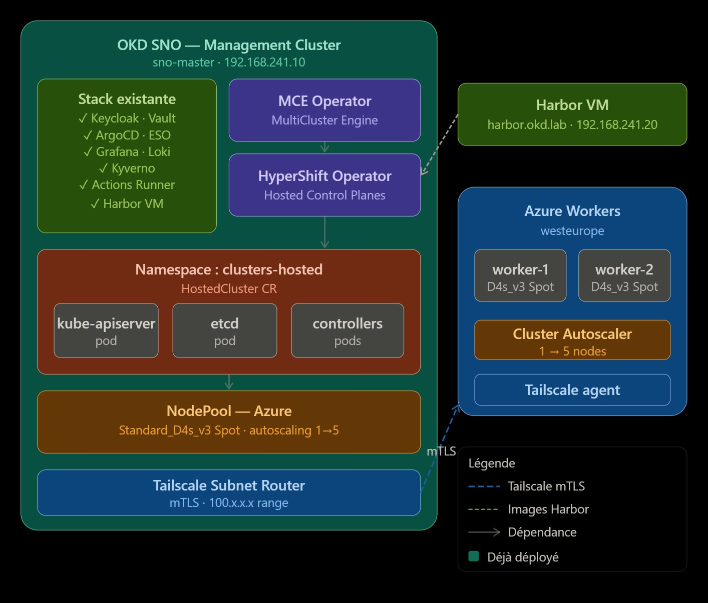
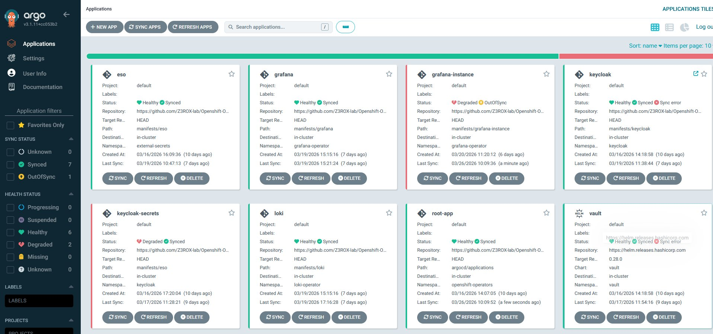
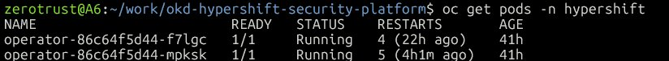
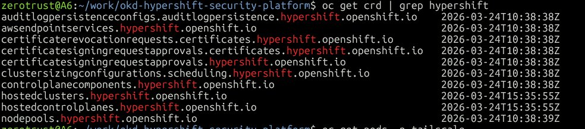
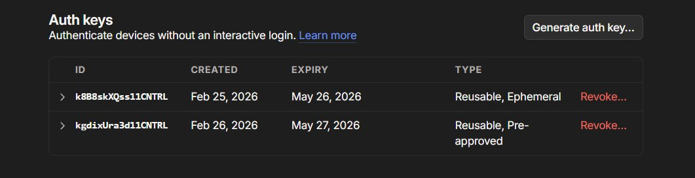
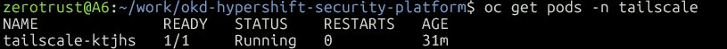
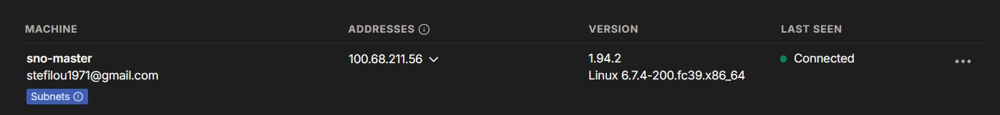
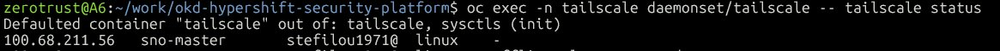

# OKD HyperShift Security Platform — Demo Walkthrough

> **Portfolio project by Stéphane Seloi** — Freelance Cloud Native Security Architect  
> This document walks through the full deployment of a HyperShift Hosted Control Plane on OKD SNO with Azure Spot workers, secured end-to-end with Zero Trust networking, GitOps, and supply chain controls.

---

## Architecture



**Key architectural insight**: HyperShift decouples the Control Plane from the Data Plane. The entire Hosted Cluster Control Plane (kube-apiserver, etcd, controllers) runs as pods inside OKD SNO, while Azure Spot VMs handle only the data plane — reducing infrastructure costs by ~60% vs a traditional cluster.

The only external attack surface is the link between the Hosted Control Plane pods and the Azure workers, secured via **Tailscale mTLS (WireGuard)**.

---

## Lab Environment

| Component | Details |
|---|---|
| Management Cluster | OKD SNO 4.15 — `sno-master` (192.168.241.10) |
| Hypervisor | VMware Workstation Pro — GEEKOM A6 (Ryzen 6900HX, 32GB DDR5) |
| Harbor VM | harbor.okd.lab — 192.168.241.20 |
| Azure Region | westeurope |
| Worker type | Standard_D4s_v3 Spot |
| Autoscaling | 1 → 5 nodes |
| Zero Trust | Tailscale WireGuard mTLS |

---

## Phase 1 — HyperShift Operator Installation

### 1.1 Prerequisites — OKD SNO cluster healthy

```bash
$ oc get nodes
NAME         STATUS   ROLES                         AGE   VERSION
sno-master   Ready    control-plane,master,worker   15d   v1.28.2
```

```bash
$ oc get applications -n argocd
NAME             SYNC STATUS   HEALTH STATUS
eso              Synced        Healthy
grafana          Synced        Healthy
keycloak         Synced        Healthy
vault            Synced        Healthy
loki             Synced        Healthy
kyverno          Synced        Healthy
root-app         Synced        Healthy
```



### 1.2 Azure Cost Management — Budget alert configured

Budget `ai-platform-budget` at $50/month active on the Azure subscription. This ensures no unexpected costs from Azure Spot workers.

### 1.3 HyperShift CLI installation

The HyperShift binary is extracted from the official container image:

```bash
podman cp \
  $(podman create --name hypershift --rm --pull always \
    quay.io/hypershift/hypershift-operator:latest \
  ):/usr/bin/hypershift /tmp/hypershift

sudo install -m 0755 /tmp/hypershift /usr/local/bin/hypershift
```

### 1.4 Compatibility patch — OKD 4.15 / Kubernetes 1.28

HyperShift `latest` uses CEL function `isIP()` introduced in Kubernetes 1.29. OKD 4.15 runs Kubernetes 1.28. The two affected CRDs are patched before apply:

```python
# Remove x-kubernetes-validations blocks containing isIP()
def remove_isip_validations(obj):
    if isinstance(obj, dict):
        if 'x-kubernetes-validations' in obj:
            obj['x-kubernetes-validations'] = [
                rule for rule in obj['x-kubernetes-validations']
                if isinstance(rule, dict) and 'isIP' not in rule.get('rule', '')
            ]
```

Applied with `--server-side` to bypass the 262144 bytes annotation limit on large CRDs:

```bash
oc apply --server-side --force-conflicts -f hypershift-install-patched.yaml
```

### 1.5 HyperShift Operator running

```bash
$ oc get pods -n hypershift
NAME                        READY   STATUS    RESTARTS   AGE
operator-86c64f5d44-f7lgc   1/1     Running   1          31m
operator-86c64f5d44-mpksk   1/1     Running   0          31m
```



### 1.6 HyperShift CRDs registered

```bash
$ oc get crd | grep hypershift
hostedclusters.hypershift.openshift.io
hostedcontrolplanes.hypershift.openshift.io
nodepools.hypershift.openshift.io
...
```



---

## Phase 2 — Tailscale Zero Trust Network

### 2.1 Why Tailscale

The Hosted Control Plane pods on OKD SNO need to communicate with Azure worker nodes over the internet. Rather than exposing a public endpoint, Tailscale provides:

- **WireGuard encryption** — all traffic between SNO and Azure workers is encrypted
- **Zero Trust** — workers authenticate with an ephemeral auth key before joining the network
- **No public IP on SNO** — the management cluster is never directly exposed

```
Azure Worker (100.x.x.x) ──── WireGuard ──── sno-master (100.68.211.56)
                                mTLS           Subnet Router 192.168.241.0/24
```

### 2.2 Tailscale Auth Keys



Two auth keys configured:
- **Reusable + Pre-approved** → for `sno-master` (permanent node)
- **Reusable + Ephemeral** → for Azure workers (automatically removed when evicted)

### 2.3 Tailscale DaemonSet deployment

Tailscale is deployed as a privileged DaemonSet on OKD SNO. Key design decisions:

| Setting | Value | Reason |
|---|---|---|
| `hostNetwork: true` | yes | Access host network interfaces |
| `dnsPolicy` | `ClusterFirstWithHostNet` | Resolve `kubernetes.default.svc` with CoreDNS |
| `serviceAccountName` | `tailscale` | Dedicated SA with RBAC to read/write Secrets |
| `SCC` | `privileged` | OpenShift requires explicit SCC grant for privileged pods |
| `TS_ROUTES` | `192.168.241.0/24` | Advertise OKD SNO subnet to Tailscale network |

```bash
$ oc get pods -n tailscale
NAME              READY   STATUS    RESTARTS   AGE
tailscale-ktjhs   1/1     Running   0          2d
```



### 2.4 sno-master connected to Tailscale network



`sno-master` is connected with IP **100.68.211.56**, advertising subnet `192.168.241.0/24` (approved). DERP relay: Frankfurt (fra) — optimal for westeurope Azure region.

```bash
$ oc exec -n tailscale daemonset/tailscale -- tailscale status
100.68.211.56   sno-master   stefilou1971@   linux   -
```



---

## Phase 3 — Azure HostedCluster Creation

> 🚧 **In progress**

### 3.1 Azure Service Principal

> **📸 Screenshot to add**: `phase3/01-azure-sp-created.png` — Service Principal creation output

### 3.2 HostedCluster CR created

> **📸 Screenshot to add**: `phase3/02-hostedcluster-cr.png` — `oc get hostedcluster -n clusters`

### 3.3 Hosted Control Plane pods running on SNO

> **📸 Screenshot to add**: `phase3/03-hcp-pods-running.png` — `oc get pods -n clusters-hosted-1`

### 3.4 Azure workers bootstrapping

> **📸 Screenshot to add**: `phase3/04-azure-vms-provisioning.png` — Azure portal VMs being created

### 3.5 Workers joining via Tailscale

> **📸 Screenshot to add**: `phase3/05-tailscale-workers-connected.png` — Tailscale dashboard with Azure workers

### 3.6 HostedCluster nodes Ready

> **📸 Screenshot to add**: `phase3/06-hosted-cluster-nodes-ready.png` — `oc get nodes` on hosted cluster

---

## Phase 4 — Supply Chain Security

> 🚧 **Planned**

### 4.1 Harbor registry — image scanning with Trivy

> **📸 Screenshot to add**: `phase4/01-harbor-trivy-scan.png`

### 4.2 Cosign image signing in CI pipeline

> **📸 Screenshot to add**: `phase4/02-cosign-signature-verified.png`

### 4.3 Kyverno policy — enforce signed images on HostedCluster

> **📸 Screenshot to add**: `phase4/03-kyverno-policy-enforced.png`

---

## Phase 5 — Observability & IAM

> 🚧 **Planned**

### 5.1 Grafana — Hosted Cluster metrics federated to SNO

> **📸 Screenshot to add**: `phase5/01-grafana-hosted-cluster-metrics.png`

### 5.2 Loki — Azure worker logs aggregated

> **📸 Screenshot to add**: `phase5/02-loki-worker-logs.png`

### 5.3 Keycloak OIDC — Hosted Cluster API authentication

> **📸 Screenshot to add**: `phase5/03-keycloak-oidc-hostedcluster.png`

### 5.4 Vault — Hosted Cluster secrets management

> **📸 Screenshot to add**: `phase5/04-vault-secrets-hostedcluster.png`

---

## Security Posture Summary

| Domain | Control | Status |
|---|---|---|
| Network | Tailscale WireGuard mTLS | ✅ Phase 2 |
| Network | Zero Trust — no public CP endpoint | ✅ Phase 2 |
| Secrets | HashiCorp Vault | ✅ Deployed |
| IAM | Keycloak OIDC SSO | ✅ Deployed |
| Supply Chain | Harbor + Trivy image scanning | 🔜 Phase 4 |
| Supply Chain | Cosign image signing | 🔜 Phase 4 |
| Policy | Kyverno admission control | ✅ Deployed |
| Observability | Prometheus + Grafana + Loki | ✅ Deployed |
| GitOps | ArgoCD — all deployments | ✅ Deployed |
| Cost | Azure budget alert $50/month | ✅ Phase 1 |

---

## Key Technical Challenges & Solutions

| Challenge | Solution |
|---|---|
| HyperShift CEL `isIP()` incompatible with k8s 1.28 | Python script to patch CRDs before apply |
| CRD too large for client-side apply (>262144 bytes) | `--server-side --force-conflicts` apply |
| Tailscale pod DNS resolution with `hostNetwork: true` | `dnsPolicy: ClusterFirstWithHostNet` |
| Tailscale pod rejected by OKD PodSecurity | Dedicated ServiceAccount + SCC `privileged` |
| MCE not available on OKD (Red Hat subscription required) | HyperShift standalone operator via CLI |

---

## Repository Structure

```
okd-hypershift-security-platform/
├── argocd/applications/
├── manifests/
│   ├── hypershift/
│   │   └── hypershift-install-patched.yaml
│   └── tailscale/
│       └── daemonset-sno.yaml
├── docs/
│   ├── architecture/
│   └── demo/
│       ├── DEMO.md
│       └── screenshots/
├── SECURITY.md
└── README.md
```

---

## Author

**Stéphane Seloi** — Freelance Cloud Native Security Architect  
GitHub: [Z3ROX-lab](https://github.com/Z3ROX-lab)  
Certifications: CCSP · AWS Solutions Architect · ISO 27001 Lead Implementer · CompTIA Security+
