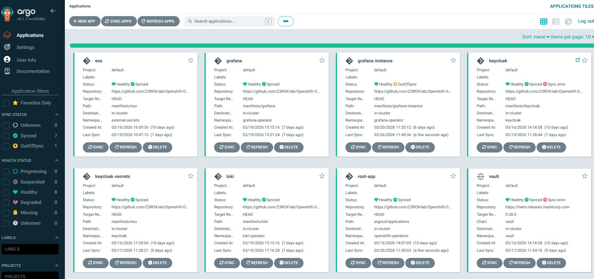
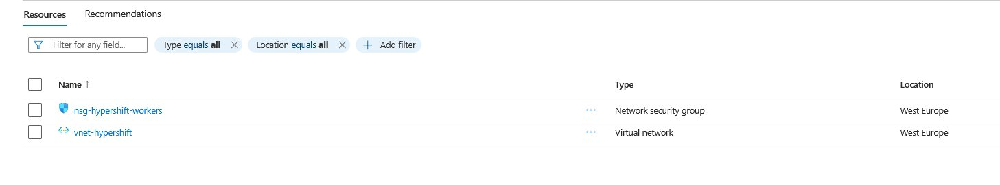
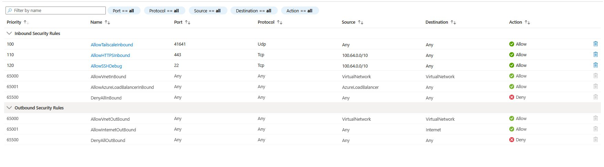
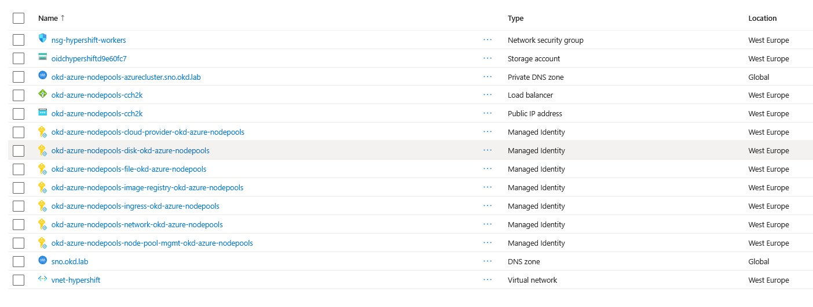

# OKD HyperShift Security Platform — Demo Walkthrough

> **Portfolio project by Stéphane Seloi** — Freelance Cloud Native Security Architect  
> This document walks through the full deployment of a HyperShift Hosted Control Plane on OKD SNO with Azure Spot workers, secured end-to-end with Zero Trust networking, GitOps, and supply chain controls.

---

## Architecture


**Key architectural insight**: HyperShift decouples the Control Plane from the Data Plane. The entire Hosted Cluster Control Plane (kube-apiserver, etcd, controllers) runs as pods inside OKD SNO, while Azure Spot VMs handle only the data plane — reducing infrastructure costs by ~60% vs a traditional cluster.

The only external attack surface is the link between the Hosted Control Plane pods and the Azure workers, secured via **Tailscale mTLS (WireGuard)**.

---

## Lab Environment

| Component | Details |
|---|---|
| Management Cluster | OKD SNO 4.15 — `sno-master` (<sno-master-ip>) |
| Hypervisor | VMware Workstation Pro — GEEKOM A6 (Ryzen 6900HX, 32GB DDR5) |
| Harbor VM | harbor.okd.lab — <harbor-ip> |
| Azure Region | westeurope |
| Worker type | Standard_D4s_v3 Spot |
| Autoscaling | 1 → 5 nodes |
| Zero Trust | Tailscale WireGuard mTLS |

---

## Phase 1 — HyperShift Operator Installation

### 1.1 Prerequisites — OKD SNO cluster healthy

```bash
$ oc get nodes
NAME         STATUS   ROLES                         AGE   VERSION
sno-master   Ready    control-plane,master,worker   15d   v1.28.2
```

```bash
$ oc get applications -n openshift-operators
NAME             SYNC STATUS   HEALTH STATUS
eso              Synced        Healthy
grafana          Synced        Healthy
keycloak         Synced        Healthy
vault            Synced        Healthy
loki             Synced        Healthy
kyverno          Synced        Healthy
root-app         Synced        Healthy
```



### 1.2 Azure Cost Management — Budget alert configured

Budget `ai-platform-budget` at $50/month active on the Azure subscription. This ensures no unexpected costs from Azure Spot workers.

### 1.3 HyperShift CLI installation

The HyperShift binary is extracted from the official container image:

```bash
podman cp \
  $(podman create --name hypershift --rm --pull always \
    quay.io/hypershift/hypershift-operator:latest \
  ):/usr/bin/hypershift /tmp/hypershift

sudo install -m 0755 /tmp/hypershift /usr/local/bin/hypershift
```

### 1.4 Compatibility patch — OKD 4.15 / Kubernetes 1.28

HyperShift `latest` uses CEL function `isIP()` introduced in Kubernetes 1.29. OKD 4.15 runs Kubernetes 1.28. The two affected CRDs are patched before apply:

```python
# Remove x-kubernetes-validations blocks containing isIP()
def remove_isip_validations(obj):
    if isinstance(obj, dict):
        if 'x-kubernetes-validations' in obj:
            obj['x-kubernetes-validations'] = [
                rule for rule in obj['x-kubernetes-validations']
                if isinstance(rule, dict) and 'isIP' not in rule.get('rule', '')
            ]
```

Applied with `--server-side` to bypass the 262144 bytes annotation limit on large CRDs:

```bash
oc apply --server-side --force-conflicts -f hypershift-install-patched.yaml
```

### 1.5 HyperShift Operator running

```bash
$ oc get pods -n hypershift
NAME                        READY   STATUS    RESTARTS   AGE
operator-86c64f5d44-f7lgc   1/1     Running   1          31m
operator-86c64f5d44-mpksk   1/1     Running   0          31m
```


### 1.6 HyperShift CRDs registered

```bash
$ oc get crd | grep hypershift
hostedclusters.hypershift.openshift.io
hostedcontrolplanes.hypershift.openshift.io
nodepools.hypershift.openshift.io
...
```


---

## Phase 2 — Tailscale Zero Trust Network

### 2.1 Why Tailscale

The Hosted Control Plane pods on OKD SNO need to communicate with Azure worker nodes over the internet. Rather than exposing a public endpoint, Tailscale provides:

- **WireGuard encryption** — all traffic between SNO and Azure workers is encrypted
- **Zero Trust** — workers authenticate with an ephemeral auth key before joining the network
- **No public IP on SNO** — the management cluster is never directly exposed

```
Azure Worker (100.x.x.x) ──── WireGuard ──── sno-master (<sno-tailscale-ip>)
                                mTLS           Subnet Router <sno-subnet>/24
```

### 2.2 Tailscale Auth Keys

> ⚠️ Screenshot omitted — contains sensitive auth key material.

Two auth keys configured:
- **Reusable + Pre-approved** → for `sno-master` (permanent node)
- **Reusable + Ephemeral** → for Azure workers (automatically removed when evicted)

### 2.3 Tailscale DaemonSet deployment

Tailscale is deployed as a privileged DaemonSet on OKD SNO. Key design decisions:

| Setting | Value | Reason |
|---|---|---|
| `hostNetwork: true` | yes | Access host network interfaces |
| `dnsPolicy` | `ClusterFirstWithHostNet` | Resolve `kubernetes.default.svc` with CoreDNS |
| `serviceAccountName` | `tailscale` | Dedicated SA with RBAC to read/write Secrets |
| `SCC` | `privileged` | OpenShift requires explicit SCC grant for privileged pods |
| `TS_ROUTES` | `<sno-subnet>/24` | Advertise OKD SNO subnet to Tailscale network |

```bash
$ oc get pods -n tailscale
NAME              READY   STATUS    RESTARTS   AGE
tailscale-ktjhs   1/1     Running   0          2d
```


### 2.4 sno-master connected to Tailscale network

> ⚠️ Screenshot omitted — contains account email and Tailscale IP.

`sno-master` is connected with IP **<sno-tailscale-ip>**, advertising subnet `<sno-subnet>/24` (approved). DERP relay: Frankfurt (fra) — optimal for westeurope Azure region.

```bash
$ oc exec -n tailscale daemonset/tailscale -- tailscale status
<sno-tailscale-ip>   sno-master   <tailscale-account>@   linux   -
```

> ⚠️ Screenshot omitted — contains account email and Tailscale IP.

---

## Phase 2b — Secrets Management (Vault → ESO → Kubernetes)

> All sensitive credentials are managed through a secure chain: HashiCorp Vault → External Secrets Operator → Kubernetes Secrets. No secrets are ever stored in Git.

### 2b.1 Vault Kubernetes Auth Backend

The Vault Kubernetes auth backend was configured to allow ESO to authenticate using its ServiceAccount JWT token, validated against the OKD SNO API server CA certificate.

```bash
# Enable Kubernetes auth
vault auth enable kubernetes

# Configure with OKD SNO CA and token reviewer
vault write auth/kubernetes/config \
  kubernetes_host="https://kubernetes.default.svc:443" \
  kubernetes_ca_cert=@/var/run/secrets/kubernetes.io/serviceaccount/ca.crt \
  token_reviewer_jwt="$(cat /var/run/secrets/kubernetes.io/serviceaccount/token)"
```

**Root cause fixed**: The Vault Kubernetes auth backend was not enabled — ESO SecretStores were returning `403 permission denied` on all namespaces.

### 2b.2 Vault Policies and Roles

Three policies and roles created for least-privilege access:

| Role | ServiceAccount | Namespace | Policies |
|------|---------------|-----------|----------|
| `keycloak` | `cluster-external-secrets` | `external-secrets` | `keycloak-policy` |
| `grafana` | `cluster-external-secrets` | `external-secrets` | `grafana-policy` |
| `eso-hypershift` | `cluster-external-secrets` | `external-secrets` | `keycloak-policy`, `grafana-policy`, `hypershift-policy` |

### 2b.3 ESO SecretStores — all healthy

```bash
$ oc get secretstore -A
NAMESPACE          NAME            STATUS   CAPABILITIES   READY
grafana-operator   vault-backend   Valid    ReadWrite      True
keycloak           vault-backend   Valid    ReadWrite      True

$ oc get externalsecret -A
NAMESPACE          NAME                       STATUS         READY
grafana-operator   grafana-prometheus-token   SecretSynced   True
keycloak           keycloak-secrets           SecretSynced   True
```


### 2b.4 ClusterSecretStore — cross-namespace for HyperShift

A `ClusterSecretStore` (cluster-scoped) was created to allow the dynamically-created `clusters` namespace to consume secrets from Vault without a per-namespace SecretStore.

```bash
$ oc get clustersecretstore
NAME                    AGE   STATUS   CAPABILITIES   READY
vault-cluster-backend   1h    Valid    ReadWrite      True
```

Managed via ArgoCD (`eso-hypershift` application) from the Airgap repo — GitOps compliant.

### 2b.5 Tailscale auth key secured in Vault

```
Vault KV: secret/hypershift/tailscale.auth-key
  → ESO ExternalSecret (namespace: clusters)
  → K8s Secret: tailscale-authkey
```

```bash
$ oc get externalsecret tailscale-authkey -n clusters
NAME                STORE                   REFRESH INTERVAL   STATUS         READY
tailscale-authkey   vault-cluster-backend   1h                 SecretSynced   True
```


### 2b.6 Azure credentials secured in Vault

```
Vault KV: secret/hypershift/azure
  ├── client-id
  ├── client-secret
  ├── tenant-id
  └── subscription-id
  → ESO ExternalSecret (namespace: clusters)
  → K8s Secret: azure-credentials (4 keys)
```

```bash
$ oc get externalsecret azure-credentials -n clusters
NAME                STORE                   REFRESH INTERVAL   STATUS         READY
azure-credentials   vault-cluster-backend   1h                 SecretSynced   True
```


### 2b.7 Secrets summary — namespace clusters ready

```bash
$ oc get secrets -n clusters
NAME                TYPE                             DATA   AGE
tailscale-authkey   Opaque                           1      4h
azure-credentials   Opaque                           4      1h
pull-secret         kubernetes.io/dockerconfigjson   1      1h
ssh-key             Opaque                           1      1h
```

All secrets required by the HostedCluster CR are present. **No secret exists in Git.**


---

## Phase 3 — Azure HostedCluster Creation

> **Status**: Hosted Control Plane successfully deployed on OKD SNO. Azure workers
> provisioning blocked by architectural constraint documented in ADR-001 (see below).

### 3.1 Azure Service Principal

A dedicated Service Principal `hypershift-azure-sp` was created with `Contributor` role
scoped to the subscription. Credentials are stored exclusively in Vault — never in Git
or environment files. The SP was immediately rotated after accidental exposure, following
security best practices.

```bash
az ad sp create-for-rbac \
  --name "hypershift-azure-sp" \
  --role Contributor \
  --scopes /subscriptions/<subscription-id> \
  --output json

# Immediate rotation after exposure
az ad sp credential reset \
  --id <app-id> \
  --output json
```

### 3.2 Azure Infrastructure — Terraform

Infrastructure provisioned via Terraform (`infra/azure/`) for reproducibility and clean
teardown. No imperative Azure CLI commands in the GitOps workflow.

```bash
cd infra/azure

# Credentials injected from Vault via ESO — never in files
export ARM_CLIENT_ID="$(oc get secret azure-credentials -n clusters \
  -o jsonpath='{.data.AZURE_CLIENT_ID}' | base64 -d)"
export ARM_CLIENT_SECRET="$(oc get secret azure-credentials -n clusters \
  -o jsonpath='{.data.AZURE_CLIENT_SECRET}' | base64 -d)"
export ARM_TENANT_ID="$(oc get secret azure-credentials -n clusters \
  -o jsonpath='{.data.AZURE_TENANT_ID}' | base64 -d)"
export ARM_SUBSCRIPTION_ID="$(oc get secret azure-credentials -n clusters \
  -o jsonpath='{.data.AZURE_SUBSCRIPTION_ID}' | base64 -d)"

export TF_VAR_subscription_id="$ARM_SUBSCRIPTION_ID"
export TF_VAR_tenant_id="$ARM_TENANT_ID"

terraform init
terraform apply -auto-approve
```

Resources created:

| Resource | Name | Location |
|----------|------|----------|
| Resource Group | rg-hypershift-okd-azure-nodepools | West Europe |
| Virtual Network | vnet-hypershift (10.0.0.0/16) | West Europe |
| Subnet | subnet-workers (10.0.1.0/24) | West Europe |
| NSG | nsg-hypershift-workers | West Europe |

NSG inbound rules:

| Priority | Rule | Protocol | Port | Source |
|----------|------|----------|------|--------|
| 100 | AllowTailscaleInbound | UDP | 41641 | * |
| 110 | AllowHTTPSInbound | TCP | 443 | 100.64.0.0/10 (Tailscale CGNAT) |
| 120 | AllowSSHDebug | TCP | 22 | 100.64.0.0/10 (Tailscale CGNAT) |




### 3.3 Workload Identities — hypershift create iam azure

HyperShift Azure requires 7 federated Managed Identities — one per control plane
component. Created via HyperShift CLI, stored locally — never committed to Git.

```bash
# Create OIDC issuer endpoint (Azure Blob Storage)
OIDC_SA_NAME="oidchypershift$(openssl rand -hex 4)"
az storage account create \
  --name "$OIDC_SA_NAME" \
  --resource-group rg-hypershift-okd-azure-nodepools \
  --location westeurope \
  --sku Standard_LRS \
  --allow-blob-public-access true

az storage container create \
  --name oidc \
  --account-name "$OIDC_SA_NAME" \
  --public-access blob

OIDC_ISSUER_URL="https://${OIDC_SA_NAME}.blob.core.windows.net/oidc"

# Create 7 Managed Identities + federated credentials
hypershift create iam azure \
  --azure-creds /tmp/azure-creds.json \
  --name okd-azure-nodepools \
  --location westeurope \
  --resource-group-name rg-hypershift-okd-azure-nodepools \
  --infra-id okd-azure-nodepools \
  --oidc-issuer-url "$OIDC_ISSUER_URL" \
  --output-file /tmp/workload-identities.json
```

Managed Identities created:

| Identity | Component |
|----------|-----------|
| okd-azure-nodepools-cloud-provider | azure-cloud-provider |
| okd-azure-nodepools-disk | cluster-storage-operator-disk |
| okd-azure-nodepools-file | cluster-storage-operator-file |
| okd-azure-nodepools-image-registry | cluster-image-registry-operator |
| okd-azure-nodepools-ingress | cluster-ingress-operator |
| okd-azure-nodepools-network | cluster-network-operator |
| okd-azure-nodepools-node-pool-mgmt | cluster-api-provider-azure |



### 3.4 HostedCluster CR — applied

```bash
hypershift create cluster azure \
  --name okd-azure-nodepools \
  --azure-creds /tmp/azure-creds.json \
  --location westeurope \
  --resource-group-name rg-hypershift-okd-azure-nodepools \
  --vnet-id "$VNET_ID" \
  --subnet-id "$SUBNET_ID" \
  --network-security-group-id "$NSG_ID" \
  --base-domain sno.okd.lab \
  --pull-secret manifests/hypershift/pull-secret.json \
  --ssh-key ~/.ssh/hypershift_workers.pub \
  --node-pool-replicas 1 \
  --instance-type Standard_D4s_v3 \
  --control-plane-availability-policy SingleReplica \
  --oidc-issuer-url "$OIDC_ISSUER_URL" \
  --workload-identities-file /tmp/workload-identities.json \
  --release-image "quay.io/openshift/okd:4.15.0-0.okd-2024-03-10-010116" \
  --kas-dns-name api-hypershift.sno.okd.lab
```

### 3.5 Hosted Control Plane pods — running on SNO

The HyperShift Operator successfully started the Hosted Control Plane components
as pods on the OKD SNO management cluster:

```
$ oc get pods -n clusters-okd-azure-nodepools
NAME                                      READY   STATUS     RESTARTS   AGE
control-plane-operator-56d896ff4c-n2scz   2/2     Running    0          80s
cluster-api-5c9f574f4-vhx47               1/1     Running    0          79s
capi-provider-5c6ff8c588-6v9jl            0/2     Init:0/1   0          79s

$ oc get hostedcluster okd-azure-nodepools -n clusters
NAME                  PROGRESS   AVAILABLE   PROGRESSING
okd-azure-nodepools   Partial    False       False

$ oc get nodepool okd-azure-nodepools -n clusters
NAME                  CLUSTER               DESIRED NODES   AUTOSCALING
okd-azure-nodepools   okd-azure-nodepools   1               False
```

**Key insight**: The entire Hosted Control Plane runs as pods on OKD SNO —
not on Azure. Only the worker nodes (data plane) would run on Azure Spot VMs.
This is the fundamental HyperShift architecture advantage.

### 3.6 OVN-Kubernetes egress fix

HyperShift Operator pods could not reach `quay.io` due to OVN-Kubernetes
routing pods via the OVN gateway (no internet route) instead of the host network.

```bash
# Fix — route pod egress via host network
oc patch network.operator cluster --type=merge \
  -p '{"spec":{"defaultNetwork":{"ovnKubernetesConfig":
       {"gatewayConfig":{"routingViaHost":true}}}}}'
```

After the OVN pods restart (~2min), pods gained internet access and HyperShift
successfully pulled the OKD release metadata from `quay.io`.

### 3.7 Architectural constraint — ADR-001

```
┌─────────────────────────────────────────────────────────────────────┐
│                    ADR-001 — HyperShift Azure LB                    │
│                                                                     │
│  CONTEXT                                                            │
│  HyperShift Azure always creates a public Azure Load Balancer       │
│  for the kube-apiserver, regardless of --kas-dns-name flag.         │
│                                                                     │
│  PROBLEM                                                            │
│  The LB backend must point to the kube-apiserver pod running        │
│  on the SNO homelab. The homelab has no public IP                   │
│  → the LB cannot route traffic to the HCP.                          │
│                                                                     │
│  ATTEMPTED SOLUTION                                                 │
│  --kas-dns-name api-hypershift.sno.okd.lab                          │
│  → changes DNS name but does NOT change LB publishing strategy      │
│                                                                     │
│  CORRECT SOLUTION (future)                                          │
│  Option A: Expose SNO kube-apiserver via Tailscale Funnel           │
│            (public HTTPS endpoint via Tailscale infrastructure)     │
│  Option B: Run HyperShift management cluster on a cloud VM          │
│            (not homelab) with public IP                             │
│  Option C: Use OpenShift Hive instead of HyperShift for             │
│            multi-cluster management from homelab                    │
│                                                                     │
│  DECISION                                                           │
│  Document limitation. Proceed with Hive-based approach in           │
│  openshift-okd-hive-multicluster-platform repo.                     │
└─────────────────────────────────────────────────────────────────────┘
```

```
ARCHITECTURE — What worked
════════════════════════════════════════════════════════════════

  OKD SNO (sno-master)
    │
    ├── HyperShift Operator          ✅ Running (2 pods)
    ├── control-plane-operator       ✅ Running
    ├── cluster-api                  ✅ Running
    ├── capi-provider                ⏳ Init (waiting for HCP Ready)
    │
    └── Hosted Control Plane         ✅ Partially started
          kube-apiserver             ✅ provisioning
          etcd                       ✅ provisioning
          controller-manager         ✅ provisioning

  Azure westeurope
    ├── Resource Group               ✅ Created via Terraform
    ├── VNet + Subnet                ✅ Created via Terraform
    ├── NSG (Tailscale + HTTPS)      ✅ Created via Terraform
    ├── 7 Managed Identities         ✅ Created via hypershift iam
    ├── OIDC Storage Account         ✅ Created
    ├── Load Balancer APIServer      ✅ Created (homelab limitation)
    └── Workers D4s_v3 Spot         ⏳ Waiting for HCP Ready

  Blocker:
    LB Azure → SNO homelab (no public IP) ❌
    Solution: Tailscale Funnel or cloud management cluster
```

### 3.8 Teardown

```bash
# Delete HostedCluster + Azure resources
hypershift destroy cluster azure \
  --name okd-azure-nodepools \
  --azure-creds /tmp/azure-creds.json \
  --resource-group-name rg-hypershift-okd-azure-nodepools

# Delete Terraform infra
cd infra/azure && terraform destroy -auto-approve
```

> **Cost for this session**: < $1 total (Azure Spot pricing + LB + Storage Account).
> All resources destroyed after validation.

## Phase 4 — Supply Chain Security

> 🚧 **Planned**

### 4.1 Harbor registry — image scanning with Trivy

> **📸 Screenshot to add**: `phase4/01-harbor-trivy-scan.png`

### 4.2 Cosign image signing in CI pipeline

> **📸 Screenshot to add**: `phase4/02-cosign-signature-verified.png`

### 4.3 Kyverno policy — enforce signed images on HostedCluster

> **📸 Screenshot to add**: `phase4/03-kyverno-policy-enforced.png`

---

## Phase 5 — Observability & IAM

> 🚧 **Planned**

### 5.1 Grafana — Hosted Cluster metrics federated to SNO

> **📸 Screenshot to add**: `phase5/01-grafana-hosted-cluster-metrics.png`

### 5.2 Loki — Azure worker logs aggregated

> **📸 Screenshot to add**: `phase5/02-loki-worker-logs.png`

### 5.3 Keycloak OIDC — Hosted Cluster API authentication

> **📸 Screenshot to add**: `phase5/03-keycloak-oidc-hostedcluster.png`

### 5.4 Vault — Hosted Cluster secrets management

> **📸 Screenshot to add**: `phase5/04-vault-secrets-hostedcluster.png`

---

## Security Posture Summary

| Domain | Control | Status |
|---|---|---|
| Network | Tailscale WireGuard mTLS | ✅ Phase 2 |
| Network | Zero Trust — no public CP endpoint | ✅ Phase 2 |
| Secrets | HashiCorp Vault + ESO | ✅ Phase 2b |
| Secrets | No secrets in Git | ✅ Phase 2b |
| IAM | Keycloak OIDC SSO | ✅ Deployed |
| IAM | Vault Kubernetes auth — least privilege | ✅ Phase 2b |
| Supply Chain | Harbor + Trivy image scanning | 🔜 Phase 4 |
| Supply Chain | Cosign image signing | 🔜 Phase 4 |
| Policy | Kyverno admission control | ✅ Deployed |
| Observability | Prometheus + Grafana + Loki | ✅ Deployed |
| GitOps | ArgoCD — all deployments | ✅ Deployed |
| IaC | Terraform — Azure infra | ✅ Phase 3 |
| Cost | Azure budget alert $50/month | ✅ Phase 1 |

---

## Key Technical Challenges & Solutions

| Challenge | Solution |
|---|---|
| HyperShift CEL `isIP()` incompatible with k8s 1.28 | Python script to patch CRDs before apply |
| CRD too large for client-side apply (>262144 bytes) | `--server-side --force-conflicts` apply |
| Tailscale pod DNS resolution with `hostNetwork: true` | `dnsPolicy: ClusterFirstWithHostNet` |
| Tailscale pod rejected by OKD PodSecurity | Dedicated ServiceAccount + SCC `privileged` |
| MCE not available on OKD (Red Hat subscription required) | HyperShift standalone operator via CLI |
| Vault Kubernetes auth backend not enabled | `vault auth enable kubernetes` + CA cert config |
| ESO `403 permission denied` on all SecretStores | Role bound to `cluster-external-secrets` SA (ESO's actual SA) |
| HyperShift Azure requires full resource IDs | Terraform outputs provide exact `/subscriptions/.../` paths |
| Azure SP credentials exposed in chat history | Immediate credential rotation via `az ad sp credential reset` |

---

## Repository Structure

```
okd-hypershift-security-platform/
├── argocd/
│   └── applications/
│       └── eso-hypershift.yaml         # ClusterSecretStore ArgoCD app
├── infra/
│   └── azure/                          # Terraform — Azure network infra
│       ├── versions.tf
│       ├── variables.tf
│       ├── main.tf
│       ├── outputs.tf
│       └── README.md
├── manifests/
│   ├── eso/
│   │   ├── cluster-secret-store.yaml   # ClusterSecretStore (ref only)
│   │   ├── externalsecret-tailscale.yaml
│   │   └── externalsecret-azure.yaml
│   ├── hypershift/
│   │   ├── hypershift-install-patched.yaml
│   │   ├── hosted-cluster.yaml         # HostedCluster CR
│   │   └── nodepool.yaml               # NodePool CR (1x D4s_v3 Spot)
│   └── tailscale/
│       └── daemonset-sno.yaml
├── docs/
│   ├── phase2b-secrets-hypershift.md
│   └── demo/
│       ├── DEMO.md
│       └── screenshots/
├── SECURITY.md
└── README.md
```

---

## Author

**Stéphane Seloi** — Freelance Cloud Native Security Architect  
GitHub: [Z3ROX-lab](https://github.com/Z3ROX-lab)  
Certifications: CCSP · AWS Solutions Architect · ISO 27001 Lead Implementer · CompTIA Security+
